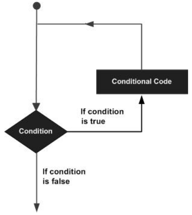

# Loops
Programming languages provide various control structures that allow for more complicated execution paths.

A loop statement allows us to execute a statement or group of statements multiple times and following is the general form of a loop statement in most of the programming languages −

C programming language provides the following types of loops to handle looping requirements.
# while loop
while loops will loop continuously, and infinitely, until the expression inside the parenthesis, () becomes false. Something must change the tested variable, or the while loop will never exit.
## while loop Syntax
```c++
while(expression) {
   Block of statements;
}
```
# do…while loop
The do…while loop is similar to the while loop. In the while loop, the loop-continuation condition is tested at the beginning of the loop before performed the body of the loop. The do…while statement tests the loop-continuation condition after performed the loop body. Therefore, the loop body will be executed at least once.

When a do…while terminates, execution continues with the statement after the while clause. It is not necessary to use braces in the do…while statement if there is only one statement in the body. However, the braces are usually included to avoid confusion between the while and do…while statements.
## do…while loop Syntax

```c++
do { 
   Block of statements; 
} 
while (expression);
```
# for loop
A for loop executes statements a predetermined number of times. The control expression for the loop is initialized, tested and manipulated entirely within the for loop parentheses. It is easy to debug the looping behavior of the structure as it is independent of the activity inside the loop.

Each for loop has up to three expressions, which determine its operation. The following example shows general for loop syntax. Notice that the three expressions in the for loop argument parentheses are separated with semicolons.
## for loop Syntax

```c++
for ( initialize; control; increment or decrement) {
   // statement block
}
```
## Example

```c++
for(counter = 2;counter <= 9;counter++) {
   //statements block will executed 10 times
}
```
# nested loop
C language allows you to use one loop inside another loop. The following example illustrates the concept.
## nested loop Syntax

```c++
for ( initialize ;control; increment or decrement) {
   // statement block
   for ( initialize ;control; increment or decrement) {
      // statement block
   }
}
```
## Example

```c++
for(counter = 0;counter <= 9;counter++) {
   //statements block will executed 10 times
   for(i = 0;i <= 99;i++) {
      //statements block will executed 100 times
   }
}
```
# infinite loop

It is the loop having no terminating condition, so the loop becomes infinite.
## infinite loop Syntax
### Using for loop

```c++
for (;;) {
   // statement block
}
```
### Using while loop
```c++
while(1) {
   // statement block
}
```

### Using do…while loop

```c++
do {
   Block of statements;
} 
while(1);
```